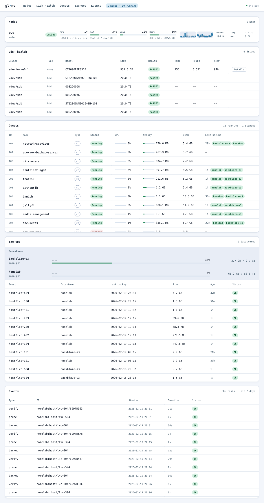
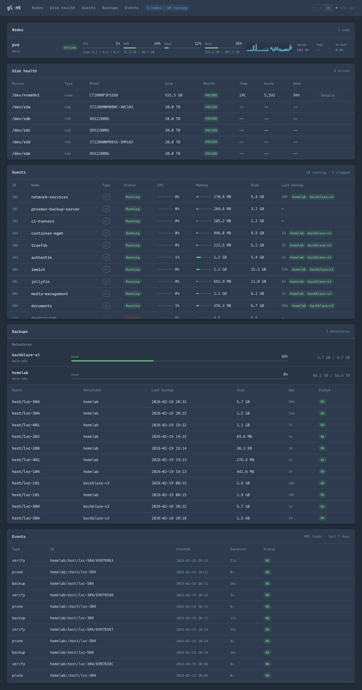

# Glint

[](https://github.com/darshan-rambhia/glint/actions/workflows/ci.yml)
[](https://github.com/darshan-rambhia/glint/releases/latest)
[](https://go.dev/)
[](LICENSE)
[](https://goreportcard.com/report/github.com/darshan-rambhia/glint)
[](https://ghcr.io/darshan-rambhia/glint)

Lightweight Proxmox monitoring dashboard. Single binary, ~10MB, ~30-50MB RAM.

**Go + templ + htmx** — server-rendered HTML with 15-second live polling. SQLite for history. No JavaScript build step.

<details open>
<summary>☀ Light</summary>

</details>

<details>
<summary>☾ Dark</summary>

</details>

## Features

- **Node monitoring** — CPU, memory, swap, root filesystem, load average, I/O wait, uptime
- **Guest monitoring** — LXC containers and QEMU VMs with status, CPU, memory, disk, network
- **PBS backup tracking** — datastore usage, backup snapshots, task history, stale backup detection
- **S.M.A.R.T. disk health** — ATA and NVMe attribute parsing with Backblaze-derived failure rate thresholds
- **Alerting** — ntfy and webhook notifications with configurable rules and deduplication
- **Multi-node ready** — supports multiple PVE instances, clusters, and PBS servers
- **Temperature monitoring** — optional SSH-based CPU temperature polling

## Quick Start

```bash
# Docker Compose
cp glint.example.yml glint.yml
# Edit glint.yml with your PVE/PBS credentials
docker compose up -d
```

```bash
# Or Docker run
docker run -d -p 3800:3800 \
  -v glint-data:/data \
  -v ./glint.yml:/etc/glint/glint.yml:ro \
  ghcr.io/darshan-rambhia/glint:latest \
  glint --config /etc/glint/glint.yml
```

```bash
# Or install with Homebrew (macOS/Linux)
brew install darshan-rambhia/tap/glint
glint --config glint.yml
```

```bash
# Or install with Go (requires Go 1.26+ and CGO)
CGO_ENABLED=1 go install github.com/darshan-rambhia/glint/cmd/glint@latest
glint --config glint.yml
```

## Documentation

Full documentation is available at **[darshan-rambhia.github.io/glint](https://darshan-rambhia.github.io/glint)**.

| Guide | Description |
|-------|-------------|
| [Getting Started](https://darshan-rambhia.github.io/glint/getting-started/) | Create API tokens, write your config, deploy |
| [Configuration](https://darshan-rambhia.github.io/glint/configuration/) | Full config reference — YAML options, env vars, defaults |
| [Deployment](https://darshan-rambhia.github.io/glint/deployment/) | Docker, Podman, Quadlet, systemd bare metal |
| [Logging](https://darshan-rambhia.github.io/glint/logging/) | Log formats, levels, systemd/journald integration |
| [Architecture](https://darshan-rambhia.github.io/glint/architecture/) | How Glint works — collectors, cache, store, alerter |
| [API Reference](https://darshan-rambhia.github.io/glint/api/) | OpenAPI spec, JSON API, htmx fragment endpoints |
| [Testing](https://darshan-rambhia.github.io/glint/testing/) | Unit tests, benchmarks, fuzz tests, coverage, linting |

## Security

Glint has **no built-in authentication**. It is designed for trusted home networks where the monitoring port is not internet-accessible.

- **Do not expose port 3800 to the internet** without a reverse proxy with authentication (Caddy, nginx, Authelia, etc.)
- For any non-LAN deployment, bind Glint to `127.0.0.1` and put it behind an authenticated reverse proxy
- API tokens for PVE/PBS are stored in your config file — protect it with `chmod 600 glint.yml`
- Setting `insecure: true` disables TLS certificate verification and logs a startup warning

## Inspiration

Glint draws heavily from two excellent projects:

- **[Pulse](https://github.com/rambhia-dev/pulse)** — Instance + node two-level hierarchy, per-instance collectors with a bounded worker pool, and snapshot-based caching. Pulse covered Proxmox host metrics and PBS backup monitoring well but lacked S.M.A.R.T. disk health tracking.
- **[Scrutiny](https://github.com/AnalogJ/scrutiny)** — WWN-based disk identity (globally unique, survives reboots and cable changes), protocol-aware SMART parsing (ATA vs NVMe vs SCSI), and Backblaze-derived failure rate thresholds for real-world risk assessment beyond manufacturer pass/fail.

## Contributing

Contributions are welcome! Please see [CONTRIBUTING.md](CONTRIBUTING.md) for guidelines.

## Development

```bash
# Prerequisites
go install github.com/a-h/templ/cmd/templ@latest
go install github.com/go-task/task/v3/cmd/task@latest

# Generate + build
task build

# Run tests
task test

# Run tests with coverage
task test:coverage

# Run locally
task run

# Lint
task lint

# Serve docs locally
pip install mkdocs-material
mkdocs serve
```

## License

[MIT](LICENSE)
